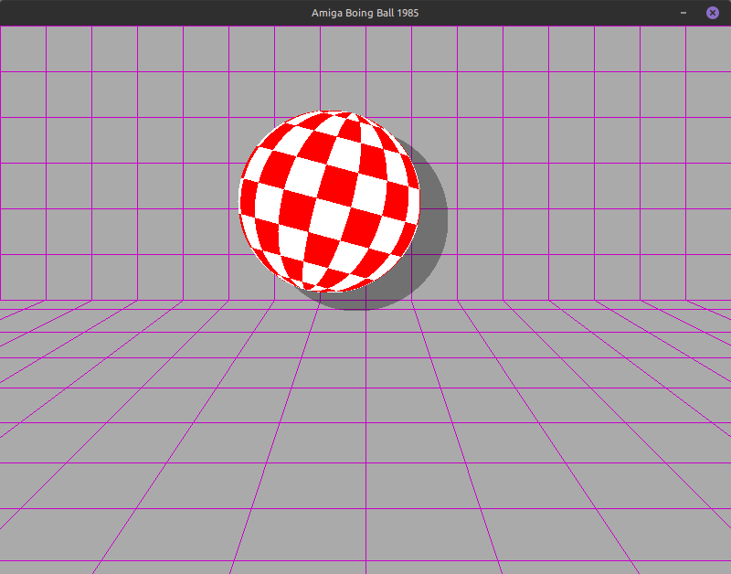

# Amiga Boing Ball

A complete, self-contained C program using SDL2 that replicates the famous **1985 Amiga Boing Ball demo**.



The original demo relied on hardware features like color cycling (shifting the palette to simulate rotation) and the blitter for movement.

Because modern hardware works differently, this replication uses real-time software raycasting to draw and map the checkered pattern onto a mathematically tilted 3D sphere. It accurately recreates the exact perspective grid (See below), smooth physics, the distinctive 15-degree right tilt, and the translucent shadow.

### Perspective grid:

To achieve this exact look, I applied a classic graphics trick called **the Painter's Algorithm** (_additive_):

1. We establish a vanishing point for the floor higher up on the screen.

2. We calculate the exact mathematical intersection where the outermost radiating floor lines hit the left and right edges of the window (X=0 and X=WIDTH).

3. We set our horizon line exactly at that Y-coordinate.

4. We draw the floor lines first, then lift the background layer over the floor by rendering a solid grey rectangle from the top of the screen down to the horizon, physically painting over the floor's vanishing point.

5. Finally, we draw the back wall grid over that solid layer.

## Usage:

You can now customize the window size, ball radius, gravity, bounce dampening, and framerate directly from the terminal.

```bash
Amiga Boing Ball 1985 Clone

Usage: ./boing-ball [options]
Options:
  -w <width>      Window width (default: 800)
  -H <height>     Window height (default: 600)
  -r <radius>     Ball radius (default: 100)
  -g <gravity>    Gravity strength (default: 0.3)
  -d <dampening>  Bounce dampening multiplier, 1.0 is endless (default: 1.0)
  -f <fps>        Target framerate (default: 60)
  -h              Show this help message
```
